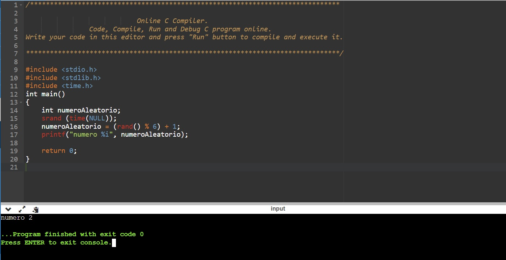

**C**

/******************************************************************************

                            Online C Compiler.
                Code, Compile, Run and Debug C program online.
Write your code in this editor and press "Run" button to compile and execute it.

*******************************************************************************/

#include <stdio.h>
#include <stdlib.h>
#include <time.h>
int main()
{
    int numeroAleatorio;
    srand (time(NULL));
    numeroAleatorio = (rand() % 6) + 1;
    printf("numero %i", numeroAleatorio);

    return 0;
}

**Python**

import random

numeroAleatorio = random.randint(1, 6)
print(numeroAleatorio)

