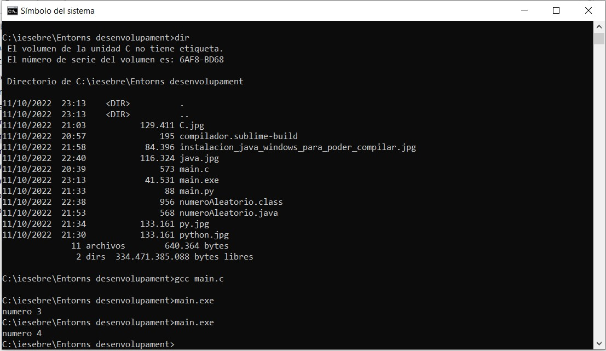
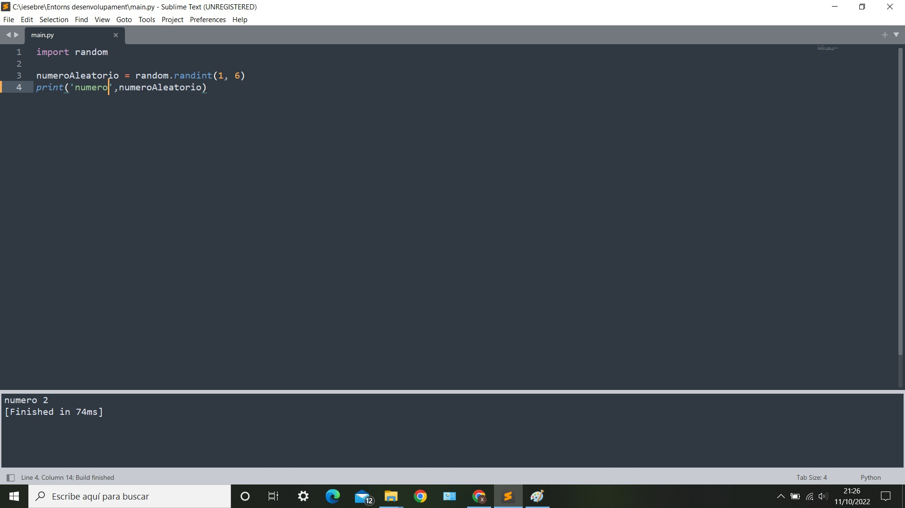
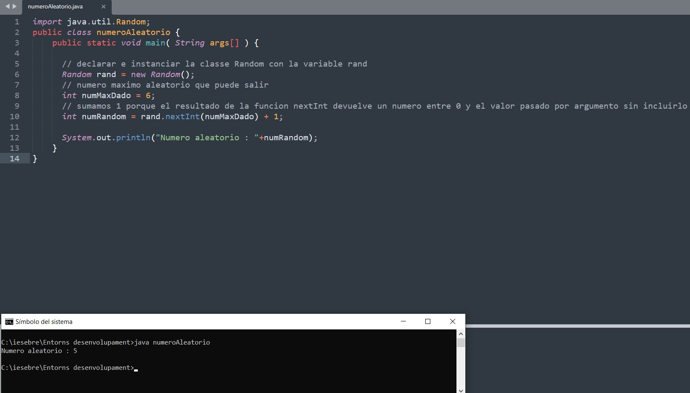

**C**

/******************************************************************************

                            Online C Compiler.
                Code, Compile, Run and Debug C program online.
Write your code in this editor and press "Run" button to compile and execute it.

*******************************************************************************/

#include <stdio.h>
#include <stdlib.h>
#include <time.h>
int main()
{
    int numeroAleatorio;
    srand (time(NULL));
    numeroAleatorio = (rand() % 6) + 1;
    printf("numero %i", numeroAleatorio);

    return 0;
}

-Instal·lar el compilador MinGW per a fcompilar fitxers en extensió .c

-Agreguem MinGW al PATH del sistema per tal que el sistema operatiu pugui buscar els executables necessaris des de la línia de comandes o el Terminal.

-Amb la següent comanda, compilarem el fitxer en C: 
   gcc main.c 
   
-L'anterior comanda generarà un .exe llest per ser executat.

**Avantatges**

Un gran avantatge dels programes que es compilen és que són unitats autònomes llestes per ser executades.

Compilar un programa també pot incrementar el desenvolupament daquest últim. Els usuaris poden enviar opcions específiques als compiladors, relacionades amb els detalls del maquinari on s'executarà el programa. Això permet que el compilador generi codi en llenguatge màquina que fa un ús més eficient del maquinari especificat, a diferència del codi més genèric.

**Desaventatges**

Atès que un compilador tradueix el codi font a un llenguatge màquina específic, els programes han de ser compilats específicament per a OS X, Windows o Linux, així com per a arquitectures de 32 o 64 bits.

Un dels desavantatges de tenir un compilador és que veritablement ha de compilar codi font. Mentre que els petits programes que molts desenvolupadors novells codifiquen requereixen quantitats trivials de temps per ser compilats, les grans suites d'aplicacions poden trigar quantitats significatives de temps a compilar.

https://techlandia.com/ventajas-desventajas-compiladores-info_103356/

**Python**

import random

numeroAleatorio = random.randint(1, 6)

print(numeroAleatorio)

-Podem executar el codi Python a través de la consola que porta integrada el SublimeText amb la comanda Ctrl+B.

-Primerament activant l'interperet de Python: tools>Build System>Python.

**Avantatges**

S'arriben a executar a qualsevol plataforma.

No ocupen gairebé espai a la memòria.

L'entorn del treball és el que s'arriba a encarregar que el maquinari executa les instruccions que se'ls doni.

Les variables de dades utilitzades arriben a ser dinàmiques per la qual cosa no es restringeixen a un tipus específic.

Aquests llenguatges són molt utilitzats en el desenvolupament web i de lelectrònica.

**Desaventatges**

L'execució d'aquests llenguatges és més lenta a diferència dels llenguatges compilats.

Són difícils de depurar.

Es necessita un programari que serveix per interpretar les instruccions del processador.

No tots els programaris estan disponibles a totes les plataformes.

https://vidabytes.com/lenguaje-interpretado/

**Java**

import java.util.Random;
public class numeroAleatorio {
    public static void main( String args[] ) {
        
      // declarar e instanciar la classe Random con la variable rand    
      Random rand = new Random(); 
      // numero maximo aleatorio que puede salir
      int numMaxDado = 6;
      // sumamos 1 porque el resultado de la funcion nextInt devuelve un numero entre 0 y el valor pasado por argumento sin incluirlo
      int numRandom = rand.nextInt(numMaxDado) + 1; 
      
      System.out.println("Numero aleatorio : "+numRandom);
    }
}

-El compilador emprat s'anomena "javac" (jaca.exe) i és l'encarregat de transformar el codi font escrit en Java al llenguatge de la màquina virtual Java (bytecode).

-Una volta instal·lat el JDK de Java.

-La comanda a utilitzar per a compilar el codi Java és: 
    javac nomdelfitxer.java
    
-La comanda anterior generarà un fitxer amb extensió .class que esta llest per executar-lo.

    
**Avantatges**

Necessita menys components físics de maquinari

Millor en termes de seguretat

Podeu executar diversos sistemes operatius

Tenir estructura ISA

**Desaventatges**

Es pot haver de sacrificar amb el rendiment

Qüestió d'eficiència en el resultat

Estructura complexa

https://aprendiendoaprogramar.es/blog/ventajas-y-desventajas-de-la-maquina-virtual/

