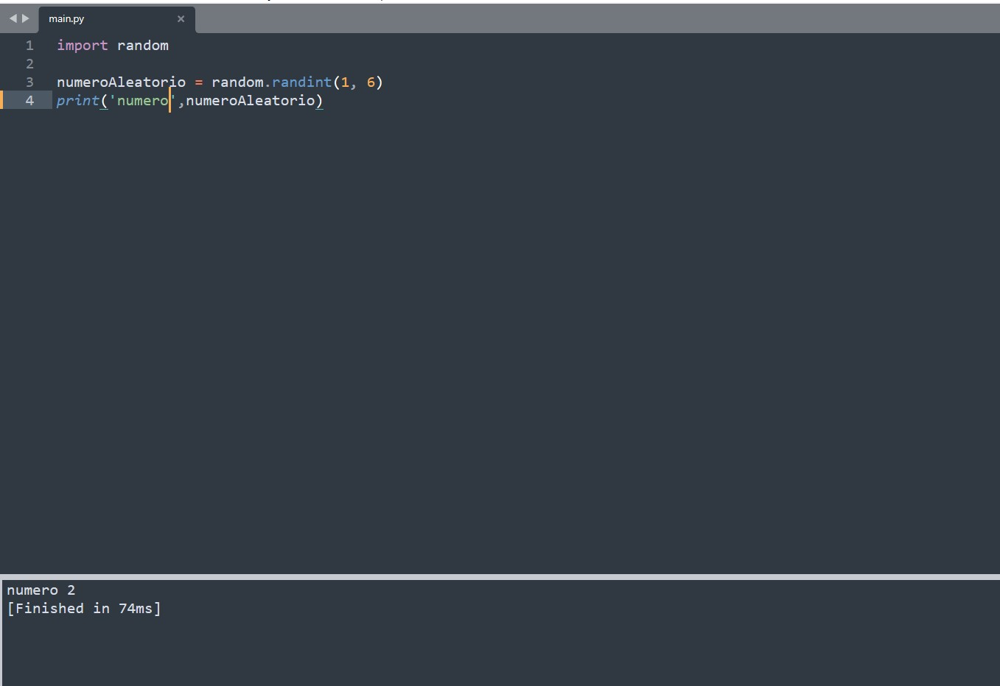

**C**

/******************************************************************************

                            Online C Compiler.
                Code, Compile, Run and Debug C program online.
Write your code in this editor and press "Run" button to compile and execute it.

*******************************************************************************/

#include <stdio.h>
#include <stdlib.h>
#include <time.h>
int main()
{
    int numeroAleatorio;
    srand (time(NULL));
    numeroAleatorio = (rand() % 6) + 1;
    printf("numero %i", numeroAleatorio);

    return 0;
}

**Python**

import random

numeroAleatorio = random.randint(1, 6)

print(numeroAleatorio)

**Java**

import java.util.Random;
public class numeroAleatorio {
    public static void main( String args[] ) {
        
      // declarar e instanciar la classe Random con la variable rand    
      Random rand = new Random(); 
      // numero maximo aleatorio que puede salir
      int numMaxDado = 6;
      // sumamos 1 porque el resultado de la funcion nextInt devuelve un numero entre 0 y el valor pasado por argumento sin incluirlo
      int numRandom = rand.nextInt(numMaxDado) + 1; 
      
      System.out.println("Numero aleatorio : "+numRandom);
    }
}

El compilador emprat s'anomena "javac" (jaca.exe) i és l'encarregat de transformar el codi font escrit en Java al llenguatge de la màquina virtual Java (bytecode). 
Una volta instal·lat el JDK de Java.
La comanda a utilitzar per a compilar el codi Java és: 
    javac nomdelfitxer.java
La comanda anterior generarà un fitxer amb extensió .class que esta llest per executar-lo.

    

