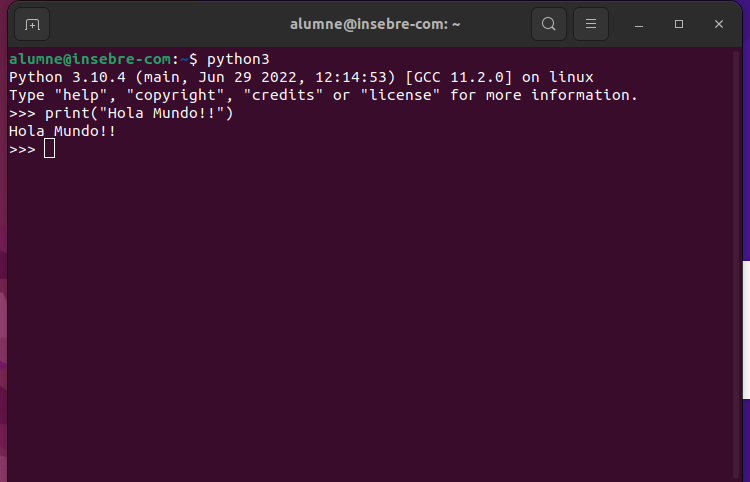
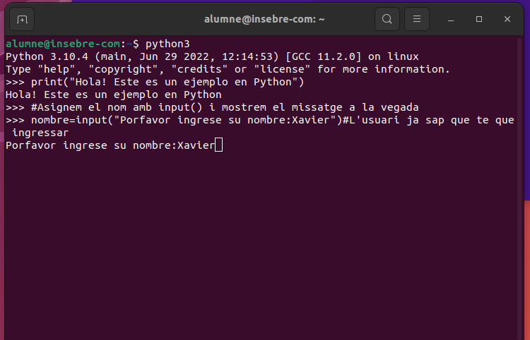
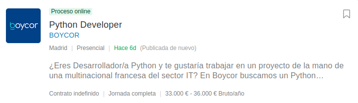
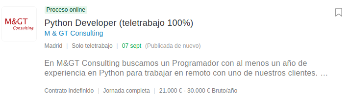
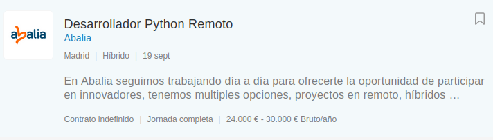

# Activitat 1

**Busca la forma de crear el programa Hello World en algun llenguatge de programació que NO sigui JAVA, PYTHON o ASSEMBLER.
Un programa Hello World imprimeix per pantalla la frase “Hello Word”.**

## EXEMPLE DE LLENGUATGE C++ "HELLO WORLD"

//Programa: HolaMundo
 
#include <iostream>
 
using namespace std;
 
int main() {
 
cout << “¡Hola Mundo!”;
 
}
    
### Explicació del codi per a programar Hola Mundo:
    
 **Línia 1:** //Programa: HolaMundo
    
    Comença amb // indicant que la resta de línies és un comentari
    
 **Línia 2:** #include <iostream>
    
    Indica al processador que té que incloure en el programa el contingut de l'encapçalament entrada/sortida
    
 **Línia 3:** using namespace std;
    
    Indica que serà utilitzat l'espai de nombres estàndards
  
 **Línia 4:** int main(){
    
  Forma part de tot programa C++. Conté l'inici de la funció main, les claus indiquen l'inici i final de la funció main
 
## ***WebGrafía***
 
 https://programacion.top/c-plus-plus/programar-un-hola-mundo-en-c-plus-plus/
    

# Activitat 2

## Activitat de recerca de llenguatges de programació:

**Es tracta de que feu un treball analitzant les principals característiques dels principals llenguatges de programació segons l'índex TIOBE que mesura la popularitat d'un llenguatge segons les referències que se'n fan a la Web.** 

**Haureu d’escollir Python i Java, a més de 2 llenguatges més del TOP 20 que us resultin interessants, 4 llenguatges en total.**

## Python

### ***Què és?***

Python és un llenguatge d'alt nivell de programació interpretat. S'utilitza per a desenvolupar aplicacions com: Instagram, Netflix, Spotify, entre altres. És un llenguatge de programació multiparadigma, ja que suporta parcialment l'orientació a objectes, la programació imperativa i funcional. És un llenguatge interpretat, dinàmic i multiplataforma.

### ***Història***

Creat a finals dels anys 80, per en Guido van Rossum al (CWI, Centre per a les Matemàtiques i la Informàtica).

El llenguatge es diu així per l’afició del seu creador als Monthy Python, humoristes britànics.

### ***Novetats o aportacions*** 

Les versions de Python s'identifiquen per tres números X.Y.Z, on: X correspon a les grans versions de Python (1, 2 i 3), incompatibles entre si

Els principals canvis introduïts a Python 2 van ser les cadenes Unicode, les comprensions de llistes, les assignacions augmentades, els nous mètodes de cadenes i el recol·lector d'escombraries per a referències cícliques.

Els principals canvis introduïts a Python 3 van ser la separació entre cadenes Unicode i dades binàries, la funció print(), canvis en la sintaxi, tipus de dades, comparadors, etc.

Ara per ara, no hi ha plans de crear una nova versió Python 4, incompatible amb les anteriors.

### ***Avantatges***

**-Llenguatge d'alt nivell**

És un llenguatge d'alt nivell per el qual és més senzill d'utilitzar. Amb Python es pot usar elements del llenguatge natural, ja que té una sintaxi similar a l'anglès, per la qual cosa és més fàcil de llegir, escriure i aprendre.

**-Polivalent i de paradigmes**

En ser un llenguatge de propòsit general, és una gran opció per al desenvolupament de software, ja que permet als desarrolladors utilitzar frameworks com Django i Flask. A més, es pot fer servir per a scripts web, desenvolupament de GUI d'escriptori o data science. És un llenguatge que admet programació estructurada, funcional i orientada a objectes.

**-Biblioteques i frameworks**

Disposa d’una àmplia col·lecció de biblioteques i frameworks. Els usuaris poden trobar biblioteques addicionals en el (Índex de paquets de Python).

**-Portabilitat**

Python és compatible amb tots els sistemes operatius (macOS, Linux, UNIX i Windows), els programes només s’han d’escriure un cop i ja es poden executar a qualsevol lloc.

**-Gratis i de codi obert**

És un llenguatge de programació amb llicència de codi obert, tothom pot utilitzar i distribuir lliurement.

**-Poca curva d’aprenentatge**

La facilitat de la sintaxi permet escriure programes funcionals en poques línies de codi, en pocs dies tothom pot aprendre a programar programes senzills.

**-Comunitat forta**

El fet que sigui gratuït i de codi obert contribueix a crear una comunitat sòlida.

### ***Desavantatges*** 

**-Lentitud**

La lentitud de Python és deguda principalment a la seva naturalesa dinàmica i versatilitat. Tot i això, hi ha maneres d'optimitzar les aplicacions de Python aprofitant la sincronització, entenent les eines de creació de perfils i considerant l'ús de múltiples intèrprets.

**-Consum de memòria**

En el cas que una tasca requereixi molta memòria, Python no és la millor opció. El consum de memòria de Python és molt alt, i això és degut a la flexibilitat dels tipus de dades.

**-Desenvolupament mòbil**

Python és ideal per a plataformes d’escriptori i servidor, però per al desenvolupament mòbil no és molt adequat. 

## Java

### ***Què és?***

Java és un llenguatge de programació àmpliament utilitzat per a codificar aplicacions web. És un llenguatge multiplataforma, orientat a objectes i centrat en la xarxa que es pot usar com una plataforma en si mateix. És ràpid, segur i fiable per a codificar aplicacions mòbils i software empresarial fins i tot aplicacions de macrodades i tecnologies del servidor.

***Alguns usos habituals:*** Desenvolupament de jocs, computació al núvol (WORA), macrodades, intel·ligència artificial (IA) , internet de les coses.
El programa Java va ser el primer llenguatge a combinar (compiladors i intèrprets) mitjançant la (JVM, Java Virtual Machine). El compilador de codi Java es Java virtual Machine.

Qualsevol fitxer Java es compila primer en codi de bytes. El codi de bytes de Java només es pot executar a la JVM. Després, la JVM interpreta el codi de bytes per executar-lo a la plataforma de maquinari subjacent. Aleshores, si l'aplicació s'executa en una màquina amb Windows, la JVM la interpretarà per a Windows. Però si s'executa en una plataforma de codi obert com a Linux, la JVM ho interpretarà per a Linux.

### ***Història:***

Alguns usos habituals: Java es va crear com a una eina de programació en Sun Microsystems l'any 1991. L'equip de desarrolladors estava compost per 13 persones i dirigit per James Gosling.

El llenguatge va néixer amb el nom de Oak, encara que més tard es va canviar el nom de Green per finalment anomenar-se tal com el coneixem avui dia: Java.

### ***Avantatges***

**-Té una corba d'aprenentatge curta**

Java no utilitza punters, fitxers de capçalera de preprocessador, instruccions d'accés, sobrecàrrega d'operadors, herència múltiple, etc. El llenguatge Java va ser dissenyat perquè el programador pugui aprendre'l fàcilment i fer-lo servir de manera efectiva.

**-Orientat a objectes**

Java està pensat per crear estructures de dades, mètodes i funcions, així com dividir projectes grans en parts més petites i versàtils. El concepte d'OOP (orientat a objectes) és el que permet als desenvolupadors del llenguatge Java reutilitzar el codi en altres programes.

**-Multiplataforma**

Java es pot utilitzar sense dependre del tipus de plataforma. Això és positiu, ja que quan treballes amb Java no és necessari un determinat tipus de ordinador o sistema operatiu. Pots fer servir el programa amb Linux, Windows, servidor SUN o al mòbil.

**-Alliberament de memòria**

Un dels avantatges del Java és que només necessites sol·licitar memòria al sistema si és que requereixes incloure'l al programa.

**-És compatible amb llibreries estàndard i editors**

Java inclou una varietat de llibreries estàndard que ajuden a fer moltes operacions (Java API). També hi ha editors molt bons, coneguts com a Entorn de Desenvolupament Integrat (IDE), que servirà d'ajuda al programa perquè sigui més fluid i còmode.

**-Seguretat**

Tot i ser un llenguatge de codi obert, els seus programes es compilen de manera original. Això vol dir que no hi ha  problemes amb els filtres de seguretat.

**-Admet subprocessos múltiples**

Java utilitza un entorn de subprocessos múltiples que permet executar més d'un subprocés alhora i per separat. Els subprocessos múltiples ajuden a obtenir la màxima utilització de la CPU sense necessitat de
proporcionar memòria a cada subprocés en execució.

**-Llenguatge de codi obert**

Està disponible manera gratuïta, per el qual els programadors el poden llegir i modificar afegint funcionalitats al software.

### ***Desavantatges*** 

**-Llenguatge interpretat**

Java treballa amb llenguatge interpretat. El llenguatge de màquina es va convertint a mesura que es va executant. Disminueix el rendiment d'execució dels programes, ja que pot presentar variables no desitjades al moment de donar una ordre inicial.

**-Es depenent**

Java conté una màquina virtual JVM, el programa és depenent d'aquesta eina i sense la màquina no pot executar els programes escrits.

**-Els seus codis escrits són detallats**

Per a algú que està intentant entendre el programa, les oracions llargues i massa complicades poden fer que el codi sigui menys llegible i escanejable.

## C

### **Què és?**

El llenguatge C és un llenguatge estructurat. És un llenguatge per a programadors en el sentit que proporciona una gran flexibilitat de programació i una molt baixa comprovació d'incorreccions, de manera que el llenguatge deixa sota la responsabilitat del programador accions que altres llenguatges realitzen per ells mateixos. Tot programa de C consta d'un conjunt de funcions, i una funció anomenada main, la qual és la primera que s'executa en començar el programa, anomenant-se des d'ella la resta de funcions del programa.

**Alguns usos habituals:** El seu propòsit específic era per a la implementació de Sistemes Operatius, concretament Unix. Encara que avui dia també s’utilitza per  crear aplicacions.

### **Història**

Originalment desenvolupat per Dennis M. Ritchie entre 1969 i 1972 als Laboratoris Bell, com a evolució de l'anterior llenguatge B.

### ***Avantatges***

**-Poderos i eficient**

C és un llenguatge robust amb diversos tipus de dades i operadors, el seu rendiment és òptim i veloç. El seu aprenentatge permet conèixer millor altres llenguatges
C és un gran punt de partida per ingressar al món del desenvolupament i comprendre'n els detalls, ja que és el llenguatge mare de molts que van venir després. 

**-Fàcil de portar**

C és un llenguatge flexible, és a dir, pots codificar i després córrer el teu programa independentment de la màquina o sistema operatiu.

**-Funcions natives**

-Posseeix una gran llibreria conformada per funcions natives. Característiques que va adoptar el seu hereu C++ i gran part dels llenguatges de programació actuals.

### ***Desavantatges***

**-No suporta OOP**

Un dels punts dèbils de C és que no suporta la Programació Orientada a Objectes, cosa pràcticament indispensable avui dia. A causa d'això va aparèixer C++.

**-No permet cheking en temps d’execució**

La detecció i depuració d'errors és molt important en la programació. En el cas de C, el compilador mostrarà els errors després de compilar, i no en temps d'execució com altres llenguatges de programació interpretats.

**-No posseeix Constructor i Destructor**

Constructor i Destructor són funcionalitat molt útils en programes orientats a objectes com c++, amb el fi de crear nous objectes. En el cas de C, aquestes característiques no existeixen.

**-Baix nivell d'abstracció**

En C, per ser un llenguatge més orientat a treballar prop la màquina, l'ocultació de dades no és la prioritat. Baixos nivells d'abstracció poden afectar la seguretat del llenguatge.

## C

### ***Què és?***

PHP és un llenguatge de programació enfocat en desenvolupar aplicacions web i crear pàgines web, afavorint la connexió entre els servidors i la interfax de l'usuari.
És de codi obert, el que significa que qualsevol pot fer canvis en la seva estructura i que es troba en constant evolució i perfeccionament gràcies a la comunitat de desarrolladors.
PHP és definit com generalment com un llenguatge del costat del servidor. Això vol dir que s’aplica en la programació que té lloc en el servidor web responsable d’executar l’aplicació, o en un lloc web.

Aquesta feina prèvia permet carregar els elements d'una pàgina web abans de mostrar a l'usuari que accedeix al lloc web, per exemple.
El codi PHP s'executa al servidor que, en llegir les comandes, pot activar tots els elements funcionals i la interfax visual del lloc web.

### ***Història***

Dissenyat originalment pel programador Rasmus Lerdorf l'any 1994 per a mostrar el seu CV i guardar dades, com la quantitat de tràfic que rebia la seva pàgina web.
Originalment, les sigles PHP volien dir "Personal Home Page Tools", però més tard dos programadors anomenats Zeev Suraski i Andi Gutmans, van reescriure l'analitzador sintàctic i van crear la base PHP3 canviant així també el nom a PHP: Hypertext Preprocessor.

### ***Avantatges***

Llenguatge totalment lliure i obert

Té una corba d'aprenentatge molt baixa

Els entorns de desenvolupament són de ràpida i fàcil configuració

Fàcil d'instal·lar: hi ha paquets autoinstal·lables que integren PHP

Fàcil accés i integració amb les bases de dades

Posseeix una comunitat molt gran

És el llenguatge amb més usabilitat al món

És un llenguatge multiplataforma

Completament orientat al desenvolupament d'aplicacions web dinàmiques o pàgines web amb accés a una base de dades

El codi escrit en PHP és invisible al navegador, ja que s'executa al costat del servidor i els resultats al navegador és HTML

Té una versatilitat per a la connexió amb la majoria de base de dades que existeixen actualment.

### ***Desavantatges***

El codi font no es pot amagar d’una manera eficient

El codi estarà segur per executar si és el nostre propi servidor.

Si un client requereix el seu codi al vostre PC, haurem de deixar el codi font, sense manera d'ocultar-lo, encara que hi ha moltes aplicacions per a PHP que ens ajuda a encriptar el codi font.

Només s'executa en un servidor i cal un servidor web perquè funcioni.

No té eines de depuració, que són necessàries per buscar errors i advertències

## ***WebGrafía***

**Python**

https://es.wikipedia.org/wiki/Python

https://keepcoding.io/blog/ventajas-y-desventajas-de-python/

**Java**

https://es.wikipedia.org/wiki/Java_(lenguaje_de_programaci%C3%B3n)

https://aws.amazon.com/es/what-is/java/

https://www.computerworld.es/archive/la-gran-aportacion-de-java-a-la-industria-es-su-caracter-de-plataforma-universal

https://www.crehana.com/blog/desarrollo-web/ventajas-desventajas-java/

**C**

https://es.wikipedia.org/wiki/C_(lenguaje_de_programaci%C3%B3n)

https://informatica.uv.es/estguia/ATD/apuntes/laboratorio/Lenguaje-C.pdf

https://www.deustoformacion.com/blog/programacion-diseno-web/que-es-lenguaje-c

https://ventajasydesventajas.top/c-ventajas/

**PHP**

https://es.wikipedia.org/wiki/PHP

https://www.php.net/manual/es/intro-whatis.php

https://www.php.net/manual/es/intro-whatis.php

https://www.baulphp.com/ventajas-y-desventajas-del-lenguaje-php/

https://talently.tech/blog/ventajas-de-php/

# Activitat 3

**Exemple de codi**

**-Demanar el nom a l'usuari i mostrar-lo** 

**-Buscar com estan les ofertes de treball a Infojobs del llenguatge**

**WebGrafía**

## ***Python***
 
 **HolaMundo**

 
 **Ingresenombre**
 
 
 
 **Infojobs**
 
 ### *Presencial*
 
 

**Estudis mínims:** CFGS Programació
 
**Experiència:** Almenys 1 any
 
**Coneixements:** Python, SQL, Django, Bigdata
 
**Duració del contracte:** Estable
 
**Salari:** 33.000€-36.000€ bruts/any
 
 
 ### *Teletreball*
 
 
 
**Estudis mínims:** CFGS Programació
 
**Experiència:** Almenys 1 any
 
**Coneixements:** Python
 
**Duració del contracte:** Indefinit, jornada completa
 
**Salari:** 21.000€-30.000€ bruts/any
 
 
 ### *Híbrid*
 
 
 
 **Estudis mínims:** CFGS Programació
 
**Experiència:** Almenys 1 any
 
**Coneixements:** Python, Jira, SQL, Git, Backend, WebServices
 
**Duració del contracte:** Indefinit, jornada completa
 
**Salari:** 24.000€-30.000€ bruts/any
 
 
 
 
 

 
    
    

